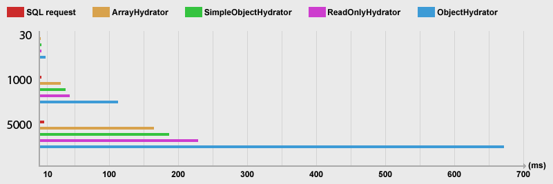

[](https://github.com/steevanb/doctrine-read-only-hydrator/tree/2.3.0)
[](http://www.doctrine-project.org)
[](http://www.doctrine-project.org)


[](https://scrutinizer-ci.com/g/steevanb/doctrine-read-only-hydrator/)

## doctrine-read-only-hydrator

When you retrieve data with Doctrine, you can get an array with values, or a fully hydrated object.

Hydration is a very slow process, who return same instance of entity if several hydrations have same entity to hydrate. 
It's fine when you want to insert / update / delete your entity. But when you just want to retrieve data without editing
it (to show it in list for example), it's way to slow.

If you want to really retrieve data from your database, and don't get UnitOfWork reference : with Doctrine hydration you can't.
Each query will not hydrate a new entity with data taken in your query result, it will return the first hydrated entity, known by UnitOfWork.

So, in case you don't need to modify your entity, you want to be really faster, or just retrieve data stored in your
database, you can use SimpleObjectHydrator or ReadOnlyHydrator.

This hydrated entities can't be persisted / flushed, because they are not registered in UnitOfwork to be faster.

Nothing will be lazy loaded : to be faster, and because most of the time, you have to create a complete QueryBuilder,
who return everything you need.

[Changelog](changelog.md)

## Benchmark

This table show simple benchmark results (time and memory_get_peak_usage()), with 30, 1000 and 5000 entities retrieved
from a MySQL 5.7 database, PHP 5.6.23 and Doctrine 2.5.4.

ArrayHydrator is used when you call $query->getArrayResult(), ObjectHydrator when you call $query->getResult(),
$repository->findAll() or $repository->findBy().

SimpleObjectHydrator and ReadOnlyHydrator are provided with this lib, see example above.

| Entities | SQL request | ArrayHydrator    | SimpleObjectHydrator | ReadOnlyHydrator | ObjectHydrator   |
| -------- | ----------- | ---------------- | -------------------- | ---------------- | ---------------- |
| 30       | 0.26ms      | 1.05 ms, 28 mo   | 1.45 ms, 28 mo       | 1.78 ms, 28 mo   | 7.94 ms, 29 mo   |
| 1000     | 1.58 ms     | 29.75 ms, 32 mo  | 37.01 ms, 29 mo      | 43.26 ms, 32 mo  | 113.45 ms, 41 mo |
| 5000     | 6.36 ms     | 164.76 ms, 48 mo | 187.30 ms, 32 mo     | 228.89 ms, 46 mo | 671.82 ms, 90 mo |



You can see hydration process is really slow ! For 5 000 entities, Doctrine ObjectHydrator is 100x slower than the SQL request...

As expected, getArrayResult() is the fastest way to retrieve data.
But, you have to work with array, so you can't use entity methods.

ReadOnlyHydrator is 4x faster than Doctrine ObjectHydrator, and only 40% slower than ArrayHydrator (who is hard to use).

Is you want to be as fast as possible, but with an entity result instead of an array, SimpleObjectHydrator looks pretty good.

## SimpleObjectHydrator

* Hydrate your entity, with all selected fields in your QueryBuilder. If you try to access a non-loaded property,
no exception will be throwned, you can call all accessors.
* No lazy loading will be executed.
* You can't persist or flush this entity.
* Usefull when you want to be faster than Doctrine ObjectHydrator (and a little little bit more than ReadOnlyHydrator),
you don't want to insert / update this entity, but doesn't ensure you can't access non-loaded property.

## ReadOnlyHydrator

* Hydrate a proxy of your entity, who throw an exception if you try to access a property who is not loaded by your QueryBuilder.
* No lazy loading will be executed.
* You can't persist or flush this entity.
* Usefull when you want to be faster than Doctrine ObjectHydrator, you don't want to insert / update this entity, and
be "sure" any access to a non-loaded property will throw an exception.

## Example

```php
# Foo\Repository\BarRepository

use steevanb\DoctrineReadOnlyHydrator\Hydrator\ReadOnlyHydrator;

class BarRepository
{
    public function getReadOnlyUser($id)
    {
        return $this
            ->createQueryBuilder('user')
            ->select('user', 'PARTIAL comments.{id, comment}')
            ->join('user.comments', 'comments')
            ->where('user.id = :id')
            ->setParameter('id', $id)
            ->getQuery()
            ->getResult(ReadOnlyHydrator::HYDRATOR_NAME);
    }
}
```

## Installation

```bash
composer require steevanb/doctrine-read-only-hydrator ^2.3
```

### Symfony 2.x or 3.x integration

```php
# app/AppKernel.php

class AppKernel extends Kernel
{
    public function registerBundles()
    {
        $bundles = [
            new steevanb\DoctrineReadOnlyHydrator\Bridge\ReadOnlyHydratorBundle\ReadOnlyHydratorBundle()
        ];
    }
}
```

### Symfony 4.x or 5.x integration

```php
# config/bundles.php

return [
    steevanb\DoctrineReadOnlyHydrator\Bridge\ReadOnlyHydratorBundle\ReadOnlyHydratorBundle::class => ['all' => true],
];

```

### Manual integration

You need to register `SimpleObjectHydrator` and `ReadOnlyHydrator` to `Doctrine\ORM\Configuration`:

```php
use steevanb\DoctrineReadOnlyHydrator\Hydrator\SimpleObjectHydrator;
use steevanb\DoctrineReadOnlyHydrator\Hydrator\ReadOnlyHydrator;

$configuration->addCustomHydrationMode(SimpleObjectHydrator::HYDRATOR_NAME, SimpleObjectHydrator::class);
$configuration->addCustomHydrationMode(ReadOnlyHydrator::HYDRATOR_NAME, ReadOnlyHydrator::class);
```

### Integration with steevanb/doctrine-stats

[steevanb/doctrine-stats](https://github.com/steevanb/doctrine-stats) add lots of statistics about Doctrine :
number of mapped entities, number of lazy loaded entities, collapse and count same sql queries, show hydration time etc.

If you use this lib, you have to add SimpleObjectHydrator and ReadOnlyHydrator hydration times :
```json
# composer.json

{
    "extra": {
        "composer-overload-class-dev": {
            "steevanb\\DoctrineReadOnlyHydrator\\Hydrator\\SimpleObjectHydrator": {
                "original-file": "vendor/steevanb/doctrine-read-only-hydrator/Hydrator/SimpleObjectHydrator.php",
                "overload-file": "vendor/steevanb/doctrine-read-only-hydrator/ComposerOverloadClass/Hydrator/SimpleObjectHydrator.php"
            },
            "steevanb\\DoctrineReadOnlyHydrator\\Hydrator\\ReadOnlyHydrator": {
                "original-file": "vendor/steevanb/doctrine-read-only-hydrator/Hydrator/ReadOnlyHydrator.php",
                "overload-file": "vendor/steevanb/doctrine-read-only-hydrator/ComposerOverloadClass/Hydrator/ReadOnlyHydrator.php"
            }
        }
    }
}
```
